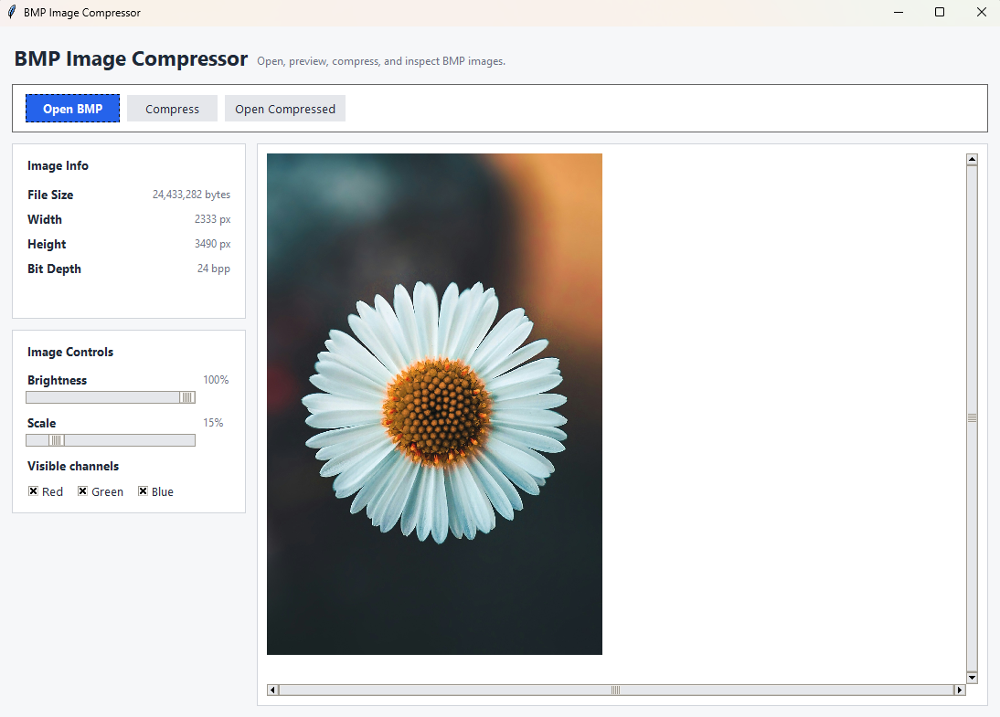
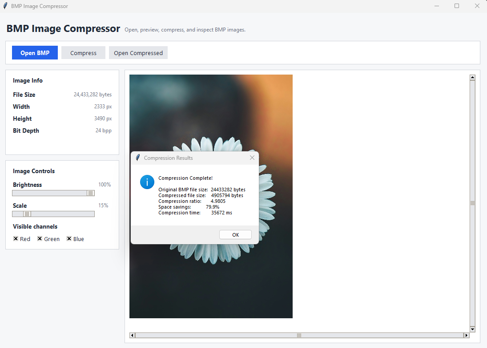

# Lossless Image Compression Engine

This project implements a lossless BMP image compression pipeline using Paeth prediction, Run-Length Encoding (RLE), and Huffman coding. It also includes a Tkinter-based desktop application for compressing, decompressing, and inspecting BMP images.

<p align="center">
  
</p>

## Features

- Uses a three-stage compression pipeline consisting of Paeth prediction, Run-Length Encoding (RLE), and Huffman coding.
- Achieves up to 77% file size reduction on tested BMP images, depending on image content and color depth.
- Supports 4-bit, 8-bit, and 24-bit BMP images.
- Displays the original file size, compressed file size, compression ratio, space saved, and compression time.
- Uses an optimized Huffman tree serialization format that reduces tree storage overhead by 40-80%, depending on the generated tree.
- Validates unsupported, corrupted, and invalid input files before processing.

##  Getting Started

### Prerequisites

- Python 3.7 or higher
- pip package manager

### Installation

1. Clone the repository:
```bash
git clone https://github.com/yAsh-081/Lossless-Image-Compression-Engine.git
cd Lossless-Image-Compression-Engine
```

2. Install the required dependencies:

```bash
pip install -r requirements.txt
```

### Usage

1. Launch the application:
```bash
python main.py
```

2. **Select an image**: Click the "Open BMP File" button to choose a BMP image

3. **Compress**: Click "Compress to .custom_compressed" and choose where to save the compressed file.

4. **View Results**: The application will display:
   - Original BMP file size
   - Compressed file size
   - Compression ratio percentage
   - Storage saved
   - Compression time

5. **Decompress** (optional): Load a compressed file and decompress it to restore the original image by clicking "Open .custom_compressed File"


<p align="center">
  
</p>

##  How It Works

The compression pipeline consists of three stages.

### 1. Paeth Prediction
Each pixel is predicted using its neighboring pixels (left, top, and top-left). Instead of storing raw pixel values, the compressor stores prediction errors, which typically have lower entropy.

### 2. Run-Length Encoding (RLE)
The prediction errors are scanned for repeated values. Consecutive runs are replaced with value-length pairs to reduce redundancy.

### 3. Huffman Coding
The RLE output is encoded using Huffman coding, assigning shorter bit sequences to more frequent symbols.

The resulting compressed data, together with image metadata and the serialized Huffman tree, is stored in the custom compressed file format.


## Technical Details

### Supported Formats
- BMP (4-bit per pixel)
- BMP (8-bit per pixel)
- BMP (24-bit per pixel)

### Output Format

Compressed images are stored in a custom binary format (`.custom_compressed`) containing:

- Image metadata
- Serialized Huffman tree
- Compressed image data

### Error Handling

The application validates common error conditions including:

- Unsupported file types
- Corrupted input files
- Invalid compressed files
- Images with uncommon dimensions

## Results

The compressor was evaluated on multiple BMP images.

| Image | Original Size (bytes) | Compressed Size (bytes) | Compression Ratio |
|--------|---------------|-----------------|-------------------|
| image1.bmp | 12,372,882 | 8,844,966 | 1.3989× |
| image2.bmp | 9,730,482 | 6,477,536 | 1.5022× |
| image3.bmp | 11,523,282 | 5,022,088 | 2.2945× |
| image4.bmp | 24,433,282 | 4,905,794 | 4.9805× |

Compression ratios vary depending on image characteristics such as color depth, repeated patterns, and local redundancy.

## Project Structure

```
Lossless-Image-Compression-Engine/
├── main.py    # Complete application (GUI + algorithms)
├── test_images/                  # Test images (4 sample BMP files with compressed version)
│   ├── image1.bmp
│   ├── image2.bmp
│   └── ...
├── requirements.txt
├── screenshots                   # Screenshots of the application for readme
└── README.md
```

## License

This project is licensed under the MIT License - see the [LICENSE](LICENSE) file for details.


**Author**: Yash Patel

GitHub: https://github.com/yAsh-081